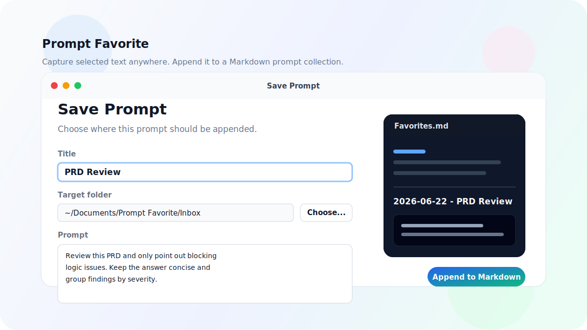

# Prompt Favorite

[English](./README.md) | 中文

在 macOS 任意 App 中选中文本，一键收藏到本地 Markdown prompt collection。

<p align="center">
  
</p>

<p align="center">
  
  
  
  
  
</p>

Prompt Favorite 是一个轻量 macOS 菜单栏 App，用来在日常工作中快速收藏可复用 prompt。你可以在 Chrome、Terminal、Codex、ChatGPT、Claude、Obsidian 或其他 App 里选中文本，触发收藏，确认内容，然后追加到一个 Markdown collection file。

目标位置就是普通本地文件夹。它可以是独立的 prompt 收藏夹，也可以是 Obsidian Vault 下的某个文件夹，或任何你已经用于管理 Markdown 的同步目录。

## 亮点

- **全局捕获**：在 App 外部选中文本后，通过连按两次 Option 或普通快捷键触发。
- **保护剪贴板**：临时复制选区后，会恢复原剪贴板内容。
- **确认或快速保存**：可在保存前修改标题、目录、文件名和正文，也可直接追加保存。
- **Collection 文件**：多条 prompt 可追加到同一个 Markdown 文件，不必每次新建一篇笔记。
- **目录选择器**：目标文件夹可以通过 macOS 目录选择器选择，不需要手写 path。
- **双语界面**：支持中文和英文，默认跟随系统，也可以在菜单里手动指定。
- **Obsidian 友好**：输出就是普通 `.md` 文件，带 frontmatter 和清晰标题。

## 安装

克隆仓库并安装到本机：

```bash
git clone https://github.com/QQQingyu/prompt-favorite.git
cd prompt-favorite
./scripts/setup_local_codesign.sh
./scripts/install_app.sh
open "$HOME/Applications/Prompt Favorite.app"
```

默认安装位置：

```text
~/Applications/Prompt Favorite.app
```

也可以指定安装目录：

```bash
./scripts/install_app.sh /Applications
```

## 首次启动

Prompt Favorite 需要 macOS 辅助功能权限，因为全局捕获会向当前前台 App 临时发送一次 `Cmd+C`。

1. 启动 App。
2. 点击菜单栏图标。
3. 先运行 **检查捕获权限**，确认当前 App 路径和权限状态。
4. 打开 **辅助功能权限设置**。
5. 允许 **Prompt Favorite**。
6. 退出并重新打开 Prompt Favorite。

如果系统设置里已经打开权限，但收藏时仍然失败，通常是 macOS 还保留了旧版本的授权记录。删除后重新添加当前安装位置的 App：

```text
~/Applications/Prompt Favorite.app
```

如果在本地开发时会反复构建和覆盖 App，先运行一次 `./scripts/setup_local_codesign.sh`。没有稳定本地签名时，macOS 可能在重新构建后保留一条看起来开启、但实际已经失效的辅助功能权限记录。

## 使用

1. 在任意 App 中选中一段文本。
2. 触发全局快捷方式，默认是 **连按两次 Option**。
3. 在预览窗口中确认标题、目标文件夹、Collection 文件和 Prompt 正文。
4. 保存。

内容会追加到：

```text
<目标文件夹>/<Collection 文件>.md
```

默认目标是：

```text
~/Documents/Prompt Favorite/Favorites.md
```

你也可以把目标文件夹指向任意 Obsidian Vault 里的目录，例如：

```text
~/Documents/Obsidian Vault/Prompt Favorite
```

## 菜单配置

- **收藏当前选中文本**：手动触发一次收藏。
- **选择目标文件夹...**：用目录选择器设置默认保存目录。
- **保存格式设置...**：设置默认 collection file、标题模板、时间格式、分割线和代码块语言。
- **全局触发方式**：选择连按两次 Option、Command + Option + P、Command + Shift + P 或关闭。
- **收藏行为**：选择保存前确认或快速保存。
- **界面语言**：选择跟随系统、中文或 English。
- **开机时自动启动**：macOS 启动后自动打开 Prompt Favorite。
- **打开目标文件夹**：打开当前 prompt 收藏目录。
- **捕获权限**：查看当前辅助功能校验状态，执行权限检查，或打开 macOS 权限设置。

## Markdown 输出格式

新 collection file 会包含 frontmatter：

````markdown
---
title: "Favorites"
tags:
  - prompt-collection
folder: "/Users/you/Documents/Prompt Favorite"
created: 2026-06-22T09:30:00Z
updated: 2026-06-22T09:35:00Z
---
````

每条收藏会按固定结构追加：

````markdown
---

## 2026-06-22 17:35:00 - PRD Review

```prompt
Review this PRD and only point out blocking logic issues.
```
````

条目标题模板支持：

```text
{{time}}
{{title}}
```

## 开发

构建 App：

```bash
./scripts/build_app.sh
```

为本地开发构建创建稳定签名身份：

```bash
./scripts/setup_local_codesign.sh
```

运行 Markdown 写入自测：

```bash
"dist/Prompt Favorite.app/Contents/MacOS/Prompt Favorite" --self-test "$PWD/tmp-self-test"
```

检查当前 App 的辅助功能权限状态：

```bash
"$HOME/Applications/Prompt Favorite.app/Contents/MacOS/Prompt Favorite" --check-accessibility
```

安装当前构建：

```bash
./scripts/install_app.sh
```

项目直接使用 `swiftc`、Cocoa 和 ApplicationServices 构建，不需要额外包管理器。

## 当前边界

- 全局捕获依赖 macOS 辅助功能权限。
- 对普通可选中、可通过 `Cmd+C` 复制的文本最稳定。
- Collection 文件是目标文件夹下的文件名；如果输入嵌套路径，会只保留最后的文件名。

## License

MIT
